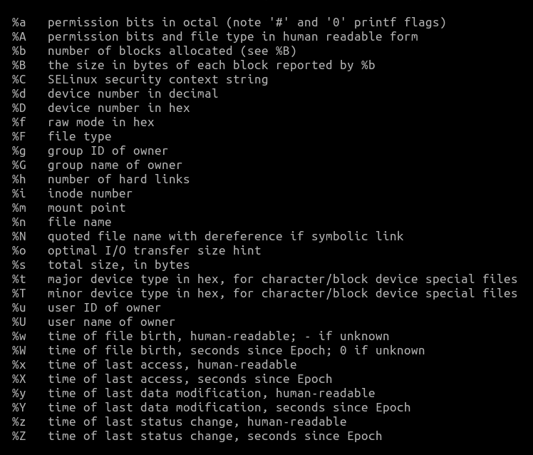

# Bash scripting
---
## - Array
```bash
#!/bin/bash
read N
declare -a array[$N]
sum=0
for (( i = 0; i < $N; i++ )) 
do
    read x
    array+=($x)
    # echo ${array[$i]}
    sum=$(( $sum + ${array[$i]} ))
    # echo $sum
done

printf "%.3f\n" `echo $sum / $N | bc -l`
```

```bash
#!/bin/bash
#
# Get the current time in seconds
current_time=$(date +%s)

# Calculate the time 3 days ago in seconds
three_days_ago=$((current_time - (3 * 24 * 60 * 60)))

# Iterate over each file in the current directory
for file in *
do
    # Check if the file was modified within the last 3 days
    if [ -f "$file" ] && [ $(stat -c %Y "$file") -ge "$three_days_ago" ]; then
        echo "$file"
    fi
done
```



[↩️](../Linux.html)
